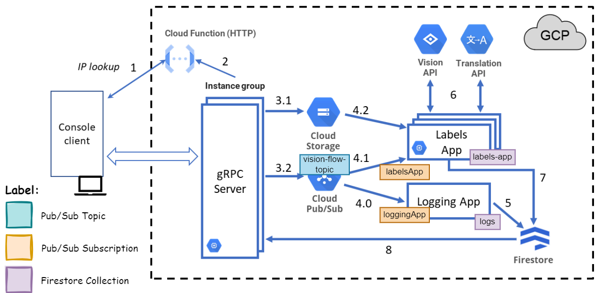

# Cloud Computing ☁️

The course aims to provide students with the knowledge and skills to design, develop, and deploy cloud-based systems.
The course covers various topics, including cloud computing concepts, cloud service models, cloud deployment models,
cloud security, and cloud-based system design. The course also includes practical assignments and a final project to
apply the concepts learned in a real-world scenario.

## Grpc Template 🛠️

All modules in this repository are based on a grpc-template project.
The template comprises a simple project in Java to implement a gRPC service on both server and client sides.
Also, the template includes a contract definition in a proto file with all 4 possible operation types between a client
and a server.
For more information, see the grpc-template [README.md](grpc-template/README.md).

## Lab Assignments 🧪

During the course, we completed several laboratory assignments to practice the concepts learned in class such as:

- GCP services introduction
- Implement contract operations in both server and client sides
- Cloud Storage API
- Firestore Database API
- Pub/Sub Messaging

All laboratory assignments are available in the [labs](labs) directory.

## Final Project 🎓

### Overview 📝

The final project focuses on developing a cloud-based system, CNV2024TF, which detects and translates image labels using
Google Cloud Platform (GCP) services.

### Objective 🎯

The main objective is to plan and implement a scalable cloud system that processes image files to detect specific
labels (e.g., "tree," "street," "night") and translate them from English to Portuguese. The system is designed to be
elastic, scaling its processing capabilities up or down based on demand.

### Key Features 🚀

- **Image Upload and Label Detection**: Users can upload image files, which are then stored in Cloud Storage. The system
  detects labels in the images using the Vision API and translates them into Portuguese.
- **Elasticity Management**: The system dynamically adjusts the number of gRPC server instances and image processing
  applications based on the workload.
- **Client Interaction**: Functional and elasticity management operations are exposed via two gRPC services hosted on
  separate servers.

### Architecture 🏗️

The system leverages several GCP services:

- **Cloud Storage**: Stores uploaded image files.
- **Firestore**: Maintains metadata about processed images, including request identifiers, processing dates, detected
  labels, and translations.
- **Pub/Sub**: Facilitates decoupled messaging between gRPC servers and image processing applications.
- **Compute Engine**: Hosts virtual machines and instance groups running the gRPC servers and image processing
  applications.
- **Cloud Functions**: Implements a lookup function for retrieving the IP addresses of gRPC server instances.

The system architecture is illustrated below:

|  |
|:-----------------------------------------------------------------------:|
|                    *CNV2024TF Architecture Diagram*                     |

> [!NOTE]
> A small report detailing the design decisions, implementation and deployment of this architecture is available [here](project/report/out/main.pdf).

### Flow of Operations 🔄

1. **Lookup Function**: The client application calls a Cloud Function to get the IP addresses of available gRPC servers.
2. **Image Submission**: The client uploads an image, which is stored in Cloud Storage, and receives a unique request
   identifier. A message containing the image details is published to a Pub/Sub topic.
3. **Image Processing**: Workers subscribe to the Pub/Sub topic, retrieve the image from Cloud Storage, detect labels
   using the Vision API, translate the labels using the Translation API, and store the results in Firestore.
4. **Data Retrieval**: The client can query gRPC servers for information about submitted images, which is fetched from
   Firestore.

---

Instituto Superior de Engenharia de Lisboa 
BSc in Computer Science and Engineering 
Cloud Computing 
Summer Semester of 2023/2024
